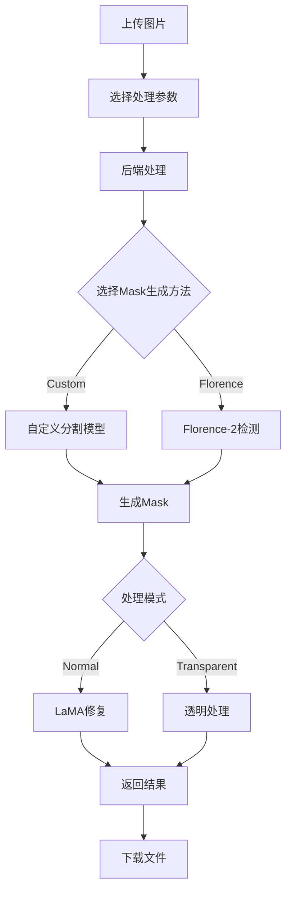

# AI Watermark Remover - Web UI

基于Streamlit的Web界面，提供与原GUI相同的功能，支持服务器部署。

## 🚀 快速开始

### 1. 环境准备

确保你在正确的conda环境中：
```bash
conda activate py310aiwatermark
```

### 2. 安装Web UI依赖

```bash
cd /home/duolaameng/SAM_Remove/WatermarkRemover-AI
pip install -r requirements_web.txt
```

### 3. 启动Web应用

使用便捷脚本：
```bash
cd /home/duolaameng/SAM_Remove/WatermarkRemover-AI
pip install -r requirements_web.txt
```
```

或手动启动：
```bash
streamlit run watermark_web_app.py --server.port 8501 --server.address 0.0.0.0
```

### 4. 访问界面

在浏览器中打开：`http://localhost:8501`

## 📋 功能特性

### 🎯 核心功能
- ✅ **单张图片处理** - 上传图片即可去除水印
- ✅ **批量处理** - 同时处理多张图片
- ✅ **透明模式** - 将水印区域设为透明而非移除
- ✅ **格式转换** - 支持PNG/WEBP/JPG输出格式
- ✅ **进度跟踪** - 实时显示处理进度

### 🔧 高级选项
- **Mask生成方法选择**：
  - Custom Model（自定义模型）- 基于FPN+MIT-B5训练的专用模型
  - Florence-2 - Microsoft的通用检测模型
- **参数调节**：
  - 最大水印尺寸百分比
  - Mask显示开关
- **系统监控**：
  - GPU/CPU使用率
  - 内存监控

### 💾 下载功能
- 单张图片下载
- 批量打包下载（ZIP格式）
- 多种输出格式支持

## 🏗️ 架构设计

### 模块化设计
```
WatermarkRemover-AI/
├── watermark_web_app.py      # Streamlit前端界面
├── web_backend.py            # 模块化后端处理逻辑
├── web_config.yaml           # 配置文件
├── run_web_app.sh           # 启动脚本
├── models/                  # 模型文件目录
│   └── epoch=071-valid_iou=0.7267.ckpt
├── temp/                    # 临时文件目录
└── output/                  # 输出目录
```

### 后端模块
- **WatermarkProcessor**: 主处理类
- **CustomMaskGenerator**: 自定义mask生成器
- **FlorenceMaskGenerator**: Florence-2 mask生成器
- **ProcessingResult**: 结果数据类

## 🧪 测试与验证

### 运行单元测试
```bash
pytest test_web_backend.py -v
```

### 验证与CLI版本一致性
```bash
python validate_consistency.py
```

这会创建测试图片，同时用CLI版本和Web版本处理，并比较结果的一致性。

### 测试覆盖范围
- ✅ 模块初始化测试
- ✅ 图片格式兼容性测试
- ✅ 处理功能测试（normal/transparent模式）
- ✅ 性能基准测试
- ✅ 端到端一致性验证

## ⚙️ 配置说明

### web_config.yaml 主要配置项

```yaml
# 应用设置
app:
  host: "0.0.0.0"          # 监听地址
  port: 8501               # 端口

# Mask生成器配置
mask_generator:
  model_type: "custom"     # "custom" 或 "florence"
  mask_model_path: "./models/epoch=071-valid_iou=0.7267.ckpt"
  image_size: 768          # 处理尺寸
  mask_threshold: 0.5      # 二值化阈值
  mask_dilate_kernel_size: 3  # 膨胀核大小

# 文件处理
files:
  max_upload_size: 10      # 最大上传文件大小(MB)
  supported_formats: ["jpg", "jpeg", "png", "webp"]
```

## 🚨 故障排除

### 常见问题

1. **模型加载失败**
   ```bash
   # 检查模型文件是否存在
   ls -la models/epoch=071-valid_iou=0.7267.ckpt
   ```

2. **CUDA内存不足**
   - 降低处理图片分辨率
   - 使用CPU模式（自动回退）

3. **依赖包缺失**
   ```bash
   pip install -r requirements_web.txt
   ```

4. **端口被占用**
   ```bash
   # 修改配置文件中的端口号，或者
   streamlit run watermark_web_app.py --server.port 8502
   ```

### 性能优化

1. **GPU加速**：
   - 确保CUDA可用
   - 监控VRAM使用情况

2. **批处理优化**：
   - 避免同时处理过多大尺寸图片
   - 使用适当的输出格式

3. **内存管理**：
   - 定期清理临时文件
   - 监控系统资源使用

## 🔧 开发指南

### 添加新功能

1. **修改后端逻辑**：编辑 `web_backend.py`
2. **更新前端界面**：编辑 `watermark_web_app.py`
3. **添加配置项**：更新 `web_config.yaml`
4. **编写测试**：在 `test_web_backend.py` 中添加测试用例

### 部署到生产环境

1. **修改配置**：
   ```yaml
   app:
     host: "0.0.0.0"
     port: 80
     debug: false
   ```

2. **使用反向代理**（推荐Nginx）

3. **资源限制**：
   - 设置合适的上传文件大小限制
   - 配置超时时间

## 🆚 与原版对比

| 功能 | PyQt6 GUI | Web UI |
|------|-----------|---------|
| 单图处理 | ✅ | ✅ |
| 批量处理 | ✅ | ✅ |
| 透明模式 | ✅ | ✅ |
| 格式选择 | ✅ | ✅ |
| 系统监控 | ✅ | ✅ |
| 远程访问 | ❌ | ✅ |
| 多用户并发 | ❌ | ✅ |
| 移动端友好 | ❌ | ✅ |

## 🔄 处理流程



## 📞 技术支持

如遇问题，请检查：
1. 环境配置是否正确
2. 模型文件是否完整
3. 运行测试验证功能
4. 查看日志输出获取详细错误信息